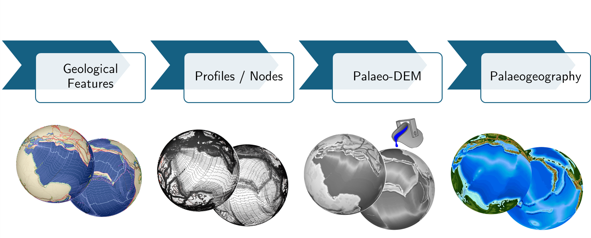
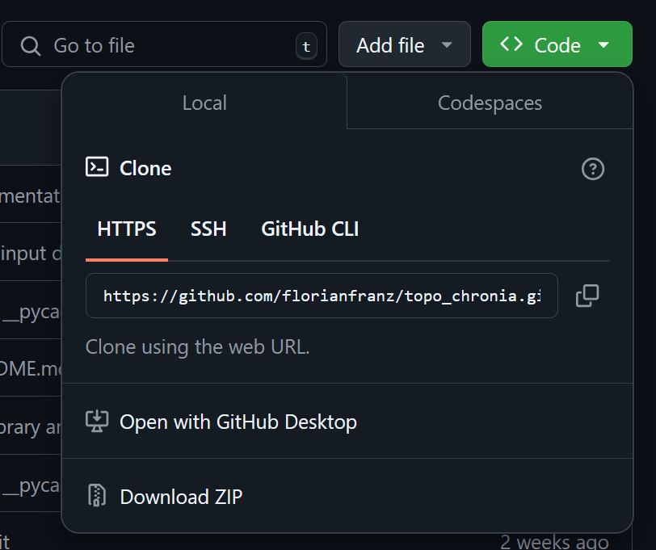
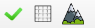

<table>
  <tr>
    <td style="width: 40%; text-align: center;">
      
    </td>
    <td style="width: 60%;">
      <h1>TopoChronia: Digital Elevation Models of the Earth Past based on the PANALESIS Plate Tectonic Model</h1>
    </td>
  </tr>
</table>

The TopoChronia Plugin is a free open source plugin 
for QGIS that converts plate tectonics input features into fully quantified 
maps of the Earth past topography (palaeotopography) and geography (palaeogeography),
using the PANALESIS plate tectonic model.

TopoChronia uses a unique approach to create a synthetic topography for selected
geological settings described in PANALESIS, including mid-oceanic ridges, isochrons,
passive margins, active margins, cratons, hot-spots, abandoned arcs, continents, rifts,
basins and other margins.

Input features (lines) are converted into an irregular grid of nodes with elevation
values, from which a Digital Elevation Model (DEM) is interpolated using the QGIS 
Triangulated Irregular Network (TIN). The oceanic volume of this DEM is then compared 
to the present-day volume, in order to assess the difference of sea-level.

## Installation

TopoChronia runs as a QGIS plugin. It can be used on QGIS version 3.36 or higher, and was developed with Python 3.12.3.

To install the plugin:

* Manual installation:
  - Go to the [repository homepage](https://github.com/florianfranz/topo_chronia) click on "Code" and "Download ZIP". 
  
  - Open QGIS → Plugins → Manage and Install Plugins → Install from .zip
  - Select the downloaded .zip folder and click on "Install".

Apart from native QGIS python libraries, the plugin also requires the `pandas` Python package, that is oftentimes not
included with QGIS. For more information, including about packages and versions, check the [requirements.txt](./requirements.txt).  

Once installed, the plugin should be listed under the "Plugin", and there should be three icons appearing on the QGIS 
toolbar as in the picture below:

Each of these icons allows to access the three main phases required by TopoChronia to process plate tectonics features 
from PANALESIS into palaeotopographic and palaeogeographic maps:

1. Phase 0: Check Configuration
2. Phase I: Create Node Grid
3. Phase II: Interpolate Raster

More details about each phase are provided in the "Functionalities" section below.

## Functionalities

For higher modularity, TopoChronia is divided into three main phases:

### Phase 0: Check Configuration
This first phase checks that all files required for processing are loaded in QGIS and fulfill requirements 
(geometry, fields, values).

TopoChronia requires the following input files from PANALESIS:
- Plate Model (PM): Lines describing the model features (see more details below).
- Plate Polygons (PP): Polygons describing the tectonic plates
- Continent-Ocean Boundary (COB): Polygons describing the boundary between continental and oceanic crust
- Geodesic Grid: Grid of points equally distant from one another.
- Accretion Rates: Table with plate velocities and accretion rates for each of the PANALESIS ages.

If all input files pass the check, this initial phase yields two outputs:
- A list of common reconstruction ages to all input files to base further processing.
- A dictionary of all input files location used later in the processing.

Should any check fail, the user will be informed about the issues. For fields that are not found, if the issue is linked
to the field names, a dialog will open and allow the user to assign the correct field and change its name.

Please note that if you wish to change the input files, you need to do all checks again.

### Phase 1: Create Node Grid

Once the checks are passed, the nodes conversion phase can start. The user can select one or more reconstruction age(s).
The processing steps are the following:

* Prepare data: All PP and COB are aggregated for the reconstruction age.
* Convert features: All settings are converted from the PM (lines) into points with synthetic topographic values.
* Merge nodes: Nodes from all settings are merged into a single nodes file.
* Clean nodes: To avoid clash between different settings at the same location, nodes are cleaned.

The picture above shows an example of the nodes distribution for the present-day PANALESIS reconstruction.

### Phase 2: Interpolate Raster

The final phase consists of interpolating a raster from the clean nodes layer. We use the QGIS
Triangulated Network (TIN) as it is the best open-source method to render topography and estimate oceans
volumes (Franziskakis et al., submitted).

This last phase is also divided into the following steps:

* Interpolate raster: perform the initial interpolation with synthetic topographic values.
* Correct water load: calculates oceanic volume, and performs corrections using the present-day volume as a reference. Adjust sea-level based on corrections.
* Interpolate final raster: Apply sea-level correction to nodes elevation values and interpolate a final raster with the corrected values.

## Documentation

A complete documentation including a step-by-step tutorial is available at https://topo-chronia.readthedocs.io/en/latest/#

For more information about the PANALESIS model, please check out the following papers:

* Vérard, C., Hochard, C., Baumgartner, P. O., Stampfli, G. M., & Liu, M. (2015). 3D palaeogeographic reconstructions of the Phanerozoic versus sea-level and Sr-ratio variations. Journal of Palaeogeography, 4(1), Article 1. https://doi.org/10.3724/SP.J.1261.2015.00068
* Vérard, C. (2019). Panalesis: Towards global synthetic palaeogeographies using integration and coupling of manifold models. Geological Magazine, 156(2), Article 2. https://doi.org/10.1017/S0016756817001042

Also, see more recent presentations about the PANALESIS transition to open-source and FAIR compliance:
* Franziskakis, F. (2024, March 8). Reconstructing the Earth in Deep-Time: A New and Open Framework for the PANALESIS Model. European Geosciences Union (EGU) General Assembly 2024, Vienna, Austria. Zenodo. https://doi.org/10.5281/zenodo.13906863
* Franziskakis, F. (2024, December 17). Quantified Palaeotopographic and Palaeogeographic Global Maps for the Phanerozoic using the PANALESIS Plate Tectonic Model. 22nd Swiss Geoscience Meeting, Basel, Switzerland. Zenodo. https://doi.org/10.5281/zenodo.14505269

## Contributing

Contributions are welcome! To contribute:
1. Fork the repository 
2. Make changes 
3. Submit a pull request

Or raise an issue [here](https://github.com/florianfranz/topo_chronia/issues). For every issue, please mention the QGIS and
Python versions you are using as well as your OS.

## Authors

* **Florian Franziskakis** - *florian.franziskakis@unige.ch*
* **Christian Vérard**
* **Grégory Giuliani**

## License

This plugin is licensed under the GNU General Public License, version 2 or later (GPLv2+). 
You can view the full license text in the [LICENSE.txt](./LICENSE.txt).

## Funding

We acknowledge financial support from the Swiss National Science Foundation (SNSF) under [Sinergia grant #213539](https://data.snf.ch/grants/grant/213539): Long-term 
evolution of the Earth from the base of the mantle to the top of the atmosphere: Understanding the mechanisms leading to 
‘greenhouse’ and ‘icehouse’ regimes.
