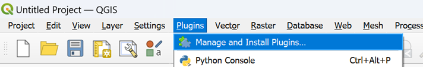
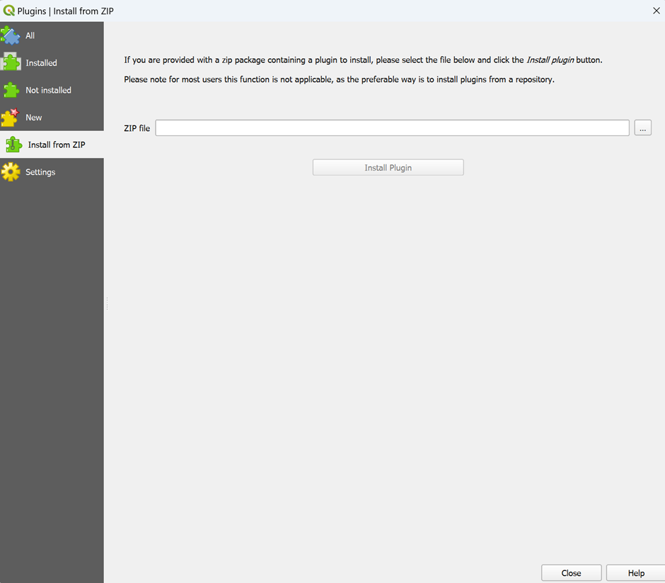

========================
TopoChronia
========================

Introduction
============

Welcome to the documentation for **TopoChronia**. This guide will help you get started and provides a step-by-step guide
to process raw input PANALESIS data into fully quantified palaeotopographic maps for the entire Phanerozoic.

Installation
============

To install the plugin, go to the `releases folder <https://github.com/florianfranz/topo_chronia/blob/master/releases/new>`_
and download the zip folder.

Once downloaded, open QGIS and click on "Plugins" → "Manage and Install Plugins".

The plugin manager window will open. On the left pane, select “Install from ZIP”, then browse to where the .zip folder
was downloaded in the previous step. Select the topo_chronia.zip file and finally click on “Install Plugin”.

After clicking on “Install Plugin”, a green message box should appear on top notifying you that the install was
successful.

**Note:** This plugin uses external libraries, such as geopy which is included within the plugin itself under
`external libraries folder <https://github.com/florianfranz/topo_chronia/blob/master/ext_libraries>`_.
Other libraries might cause trouble depending on your Python version and dependencies.
These libraries are listed in the `requirements <https://github.com/florianfranz/topo_chronia/blob/master/requirements.txt>`_.
and can be installed using the OSGeo4W Shell (Windows) or in the standard Python
installation.

If successful, your toolbar should have three new icons, representing the three TopoChronia phases:

.. image:: _static/three_icons.png
   :alt: Description of the image
   :width: 400px
   :align: center

Usage
=====
* **Phase 0: Check Configuration.** This phase is to ensure that all input data and variables are in the correct format so they can be used seamlessly.
* **Phase I: Create Node Grid.** This phase converts input data from feature types, plate boundaries and others into a node grid raster file.
* **Phase II: Interpolate Raster.** This final phase creates the topographic raster and calculates sea-level variations.

You can access each phase by clicking on the respective icon. Alternatively, you can always access the TopoChronia
functionalities by going to the “Plugins” in the upper ribbon and clicking on “TopoChronia”.

Check Configuration
-------------------
For demo purposes, input files for the 444 Ma reconstruction have been added to this repository. Go to the
`data folder <https://github.com/florianfranz/topo_chronia/blob/master/data>`_ and download the "PAN_data_444.zip".
This folder contains the Plate Model (PM), the Plate Polygons (PP), the Continent-Ocean Boundary Polygons (COB), the
Geodesic Grid Points and the Global Average Accretion Velocities table.

Once downloaded, unzip the folder and load the layers in QGIS, including the Global Average Accretion Velocities table
(for the latter, only add the "Accretion Rates", we will not need the "Recon Data").

As we are going to use many different input files to run our reconstructions, we need to make sure that everything
aligns with the requirements of the model. We are therefore going to perform some configuration checks on the input
data that will inspect that:

* Geometries are correct.
* Required attributes are present.
* No attributes contain invalid values, blanks, or “None”.
* Ages for reconstructions are all listed.

Click on the green check icon to start. A dialog box opens that will allow to check the relevant input data:

.. image:: _static/check_conf.png
   :alt: Description of the image
   :width: 700px
   :align: center

Here, the PM file is missing the field "AGE", which we will need to match with another field that might have another name.
(We assume the field exists, it just has the wrong name). To correct this, we will edit the input layer to change the
field name. Click on the "Match Fields" button. A new dialog will open:

.. image:: _static/match_fields.png
   :alt: Description of the image
   :width: 700px
   :align: center

Here, you can select the field that matches the required "AGE" field in a dropdown menu. In our case, for some reason,
the field was wrongly named "AGE_1". Select it and click on "Match Fields". The layer will be edited to have the field
renamed to "AGE". You should see a success message appearing:

.. image:: _static/matched.png
   :alt: Description of the image
   :width: 700px
   :align: center

Click on "OK" and go back to the check configuration window. Now, clicking again on "Check" will render a success
message, confirming that all checks have been passed.

One last step before finishing this phase, select an output folder location: this is where all outputs will be stored.

Once all checks are passed, we now have the option to move to Phase I: Create Node Grid. In order to avoid the need to
repeat all checks every time, the results of this phase are stored in a “input_files.txt” in the default folder of QGIS,
typically:

* For Windows: C:\Users\YourUsername\Documents
* For macOS: /Users/YourUsername/Documents
* For Linux: /home/yourusername/Documents

In this file, all paths to the input layers are listed in a json dictionary as follows (with your own path for each
layer):

.. code-block:: json

   {
       "Plate Model": "",
       "Plate Polygons": "",
       "Continent Polygons": "",
       "Geodesic Grid": "",
       "Accretion Rates": "",
       "Output Folder": ""
   }

We are now all set to start the node grid creation. Click on "Go to Next Phase".

Create Node Grid
----------------

A new dialog will open:

.. image:: _static/create_node_grid.png
   :alt: Description of the image
   :width: 700px
   :align: center

This phase is the longest and requires a few steps. First, click on "Create Age List". This will check what
reconstruction ages are common to the input layers (PM, PP and COB). in our case, we only have the 444 Ma age, which is
displayed with its stratigraphic stage name, based on the `International Chronographic Chart of December 2024
(International Commission on Stratigraphy) <https://stratigraphy.org/ICSchart/ChronostratChart2024-12.pdf>`_

.. image:: _static/age_list.png
   :alt: Description of the image
   :width: 400px
   :align: center

Click on the desired age, and then click on "Prepare Data". This will create two layers in your output folders, which
are continent and plate polygons for the selected age only, that will be used later on during the nodes creation (for
instance to check for intersections). Once completed (it should take a minute or so), the progress bar should show 100%.

The next phase is the conversion from lines (extracted from the PM) into nodes with elevation. It may take up to 1 hours
to process everything. In order, clicking on the "Convert Features" button will perform the following operations:

* Select lines (extract all lines from the PM for all features, harmonize vertices density and, if needed, create polygons for specific settings, such as hot-spots and cratons)
* Ridges to nodes (RID)
* Isochron to nodes (ISO)
* Preliminary raster interpolation (only using ridge and isochron nodes)

Then, once the preliminary raster is interpolated, the remaining features are processed in parallel, using threads:

* Lower subduction (LWS) to nodes
* Abandoned arc (ABA) to nodes
* Passive margin wedge (PMW) to nodes
* Continent (CTN) to nodes
* Craton (CRA) to nodes
* Other margin (OTM) to nodes
* Passive margin continent (PMC) to nodes
* Rift and basins (RIB) to nodes
* Upper subduction (UPS) to nodes
* Collision (COL) to nodes
* Hot-spots (HOT) to nodes

The result are stored in nodes layer per setting with the reconstruction age, e.g. "RID_nodes_444.geojson". For now,
no checks for intersection or overlap between different settings have been made, and the nodes look like this:

.. image:: _static/setting_nodes.png
   :alt: Description of the image
   :width: 600px
   :align: center

We can now go on with the next step which is merge all nodes into a single layer "all_nodes_444.geojson", by clicking
on "Merge All Nodes". Once this is done, we are ready for the last step that is the cleaning of nodes from different
settings that might clash (either be too close from one another or overlap). This final operation might take some time
because we need to check every node against all nodes present in a certain radius.

After the cleaning process is done, we have a layer containing all nodes that render coherent settings, without clashes.

.. image:: _static/all_nodes.png
   :alt: Description of the image
   :width: 700px
   :align: center

Interpolate Raster
------------------

Contributing
============

To contribute:

1. Fork the repository
2. Make changes
3. Submit a pull request

License
=======
This plugin is licensed under the GNU General Public License, version 2 or later (GPLv2+).
See the TopoChronia `LICENSE <https://github.com/florianfranz/topo_chronia/blob/master/LICENSE.txt>`_ for details.

