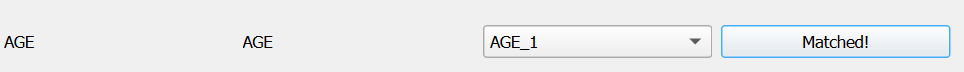
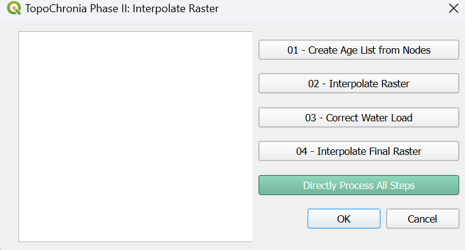

========================
TopoChronia
========================

.. contents:: Table of Contents
   :depth: 2
   :local:

Introduction
============

Welcome to the documentation for `TopoChronia <https://github.com/florianfranz/topo_chronia>`_. This guide will help you get started and provides step-by-step instructions
to process raw input PANALESIS data into fully quantified palaeotopographic maps for the entire Phanerozoic.

Installation
============

To install the plugin, Go to the `releases page <https://github.com/florianfranz/topo_chronia/releases/latest>`_, under "Assets", click on "topo_chronia.zip" to start the download.

Once downloaded, open QGIS and click on "Plugins" / "Manage and Install Plugins".

The plugin manager window will open. On the left pane, select "Install from ZIP", then browse to where the .zip folder
was downloaded in the previous step. Select the topo_chronia.zip file and finally click on "Install Plugin".

After clicking on "Install Plugin", a green message box should appear on top notifying you that the install was
successful. If you see a message about pandas dependencies needing manual installation, just click on "ok".

If the pandas library needs manual installation, the process is straightforward on Windows.

::

    Open the OSGeo4W Shell (Open Source Geospatial 4 Windows Shell) from the Start menu and run the following command:
    pip install pandas

On other platforms, you might need to check what Python environment is used by QGIS.
To install pandas in QGIS on macOS or Linux, follow these steps:

::

    Open QGIS and in the Python Console, run:
    import sys
    print(sys.executable)

    You will get a path like:
    **macOS** /Applications/QGIS.app/Contents/MacOS/bin/python3
    **Linux** /usr/bin/python3 or /usr/local/bin/python3 (depending on your installation)

    Open your terminal and run the following command:

       /your/path/ending/with/python3 -m pip install pandas

**Note:** This plugin uses external libraries, such as geopy and geographilib which are included within the plugin itself under
`external libraries folder <https://github.com/florianfranz/topo_chronia/blob/master/ext_libraries>`_.
Other libraries might cause trouble depending on your Python version and dependencies.
These libraries are listed in the `requirements <https://github.com/florianfranz/topo_chronia/blob/master/requirements.txt>`_.
and can be installed using the OSGeo4W Shell (Windows) or in the standard Python installation for macOS and Linux, as described above.
TopoChronia requires GEOS v3.10 or higher for some vector operations, make sure to check your version of GEOS in the "About"
section of QGIS.
If successful, your toolbar should have three new icons, representing the three TopoChronia phases:

Usage
=====
* **Phase 0: Check Configuration.** This phase is to ensure that all input data and variables are in the correct format so they can be used seamlessly.
* **Phase I: Create Node Grid.** This phase converts input data from feature types, plate boundaries and others into a node grid raster file.
* **Phase II: Interpolate Raster.** This final phase creates the topographic raster and calculates sea-level variations.

You can access each phase by clicking on the respective icon. Alternatively, you can always access the TopoChronia
functionalities by going to the “Plugins” in the upper ribbon and clicking on “TopoChronia”.

Check Configuration
-------------------
For demo purposes, input files for the 444 Ma reconstruction have been added to this repository. Go to the
`data folder <https://github.com/florianfranz/topo_chronia/blob/master/data>`_ and download the "PAN_data_444.zip".
This folder contains the Plate Model (PM), the Plate Polygons (PP), the Continent-Ocean Boundary Polygons (COB), the
Geodesic Grid Points and the Global Average Accretion Velocities table.

Once downloaded, unzip the folder and load the layers in QGIS, including the Global Average Accretion Velocities table
(for the latter, only add the "Accretion Rates", we will not need the "Recon Data").

As we are going to use many different input files to run our reconstructions, we need to make sure that everything
aligns with the requirements of the model. We are therefore going to perform some configuration checks on the input
data that will inspect that:

* Geometries are correct.
* Required attributes are present.
* No attributes contain invalid values, blanks, or “None”.
* Ages for reconstructions are all listed.

Click on the green check icon to start. A dialog box opens that will allow to check the relevant input data:

.. image:: _static/check_conf.png
   :alt: Description of the image
   :width: 700px
   :align: center

Here, the PM file is missing the field "AGE", which we will need to match with another field that might have another name.
(We assume the field exists, it just has the wrong name). To correct this, we will edit the input layer to change the
field name. Click on the "Match Fields" button. A new dialog will open:

.. image:: _static/match_fields.png
   :alt: Description of the image
   :width: 700px
   :align: center

Here, you can select the field that matches the required "AGE" field in a dropdown menu. In our case, for some reason,
the field was wrongly named "AGE_1". Select it and click on "Match Fields". The layer will be edited to have the field
renamed to "AGE". You should see a success message appearing:

Click on "OK" and go back to the check configuration window. Now, clicking again on "Check" will render a success
message, confirming that all checks have been passed.

One last step before finishing this phase, select an output folder location: this is where all outputs will be stored.

Once all checks are passed, we now have the option to move to Phase I: Create Node Grid. In order to avoid the need to
repeat all checks every time, the results of this phase are stored in a “input_files.txt”, typically:

* For Windows: C://Users/YourUsername/Documents
* For macOS: /Users/YourUsername/Desktop
* For Linux: /home/yourusername/Desktop

In this file, all paths to the input layers are listed in a json dictionary as follows (with your own path for each
layer):

.. code-block:: json

   {
       "Plate Model": "PATH/TO/YOUR/PM/LAYER",
       "Plate Polygons": "PATH/TO/YOUR/PP/LAYER",
       "Continent Polygons": "PATH/TO/YOUR/COB/LAYER",
       "Geodesic Grid": "PATH/TO/YOUR/GEODESIC/GRID/LAYER",
       "Accretion Rates": "PATH/TO/YOUR/ACCRETION/RATES/TABLE",
       "Output Folder": "PATH/TO/YOUR/OUTPUT/FOLDER"
   }

We are now all set to start the node grid creation. Click on "Go to Next Phase".

Create Node Grid
----------------

A new dialog will open:

.. image:: _static/create_node_grid.png
   :alt: Description of the image
   :width: 700px
   :align: center

This phase is the longest and requires a few steps. First, click on "01 - Create Age List". This will check what
reconstruction ages are common to the input layers (PM, PP and COB). in our case, we only have the 444 Ma age, which is
displayed with its stratigraphic stage name, based on the `International Chronographic Chart of December 2024
(International Commission on Stratigraphy) <https://stratigraphy.org/ICSchart/ChronostratChart2024-12.pdf>`_

The next phase is the conversion from lines (extracted from the PM) into nodes with elevation. It may take up to a few minutes
to process everything. In order to start, clicking on the "02 - Convert Features" button will perform the following operations:

* Prepare data: extract COB and PP for the desired age.
* Select lines (extract all lines from the PM for all features, harmonize vertices density and, if needed, create polygons for specific settings, such as hot-spots and cratons)
* Ridges (RID) to nodes
* Isochron (ISO) to nodes
* Preliminary raster interpolation (only using ridge and isochron nodes)

To avoid the QGIS interface from freezing and optimize the computing time, the lines selections as well as the ridge and isochrons conversions are sent to threads.
The preliminary raster interpolation however is very unstable with threads so it is processed normally. Having the interface freezing for a few seconds (up to a minute) is therefore possible.
Then, once the preliminary raster is interpolated, the remaining features are processed in parallel, using threads:

* Lower subduction (LWS) to nodes
* Abandoned arc (ABA) to nodes
* Passive margin wedge (PMW) to nodes
* Continent (CTN) to nodes
* Craton (CRA) to nodes
* Other margin (OTM) to nodes
* Passive margin continent (PMC) to nodes
* Rift and basins (RIB) to nodes
* Upper subduction (UPS) to nodes
* Collision (COL) to nodes
* Hot-spots (HOT) to nodes

The result are stored in nodes layer per setting with the reconstruction age, e.g. "RID_nodes_444.geojson". For now,
no checks for intersection or overlap between different settings have been made, and the nodes look like this:

.. image:: _static/setting_nodes.png
   :alt: Description of the image
   :width: 600px
   :align: center

We can now go on with the next step which is merge all nodes into a single layer "all_nodes_444.geojson", by clicking
on "03 -Merge All Nodes". Once this is done, we are ready for the last step that is the cleaning of nodes from different
settings that might clash (either be too close from one another or overlap) by clicking on "04 - Clean Nodes". This final operation might take some time
because we need to check every node against all nodes present in a certain radius.

After the cleaning process is done, we have a layer containing all nodes that render coherent settings, without clashes.

.. image:: _static/all_nodes.png
   :alt: Description of the image
   :width: 700px
   :align: center

**NB:** The demo data is provided following a "Europe-fixed" frame, which explains why it differs from other sources. We
strongly advise not using the demo data for any other purposes outside of testing this plugin.

**NB:**: If you want to perform all steps in one go, you just need to click on "Directly Process All Steps" green button.

Interpolate Raster
------------------
This last phase takes the cleaned input nodes and performs an interpolation using the QGIS Triangulated Irregular
Network (TIN) method, using each node synthetic elevation value.

Click on the last icon "Interpolate Raster", a new dialog will open:

As per the last phase, a few steps are required here. First, click on "01 - Create Age List from Nodes" will search the
output folder for all nodes layer and return the available ages.

Like we did before, select the 444 Ma age and click on "02 - Interpolate Raster". This step will perform a few tasks before
doing the interpolation itself, including remove any duplicate geometries and reproject the nodes layer into ESRI:54034
projection - World Cylindrical Equal Area (WCEA).

The reprojection is done on the nodes layer rather than on the raster because it reduces uncertainties when calculating
the volume of oceans later, which requires metric units and pixels with equal area.

Finally, once the raster is interpolated, no-data pixels are filled. As other methods such as Inverse Distance Weighted
(IDW) or Nearest neighbour (NN) produce a significant amount of no-data pixels, the TIN method only shows no-data pixels
on the corners of the map.

.. image:: _static/int_raster_map_1.png
   :alt: Description of the image
   :width: 700px
   :align: center

We are now able to calculate the oceanic volume (simplified as being the volume below elevation = 0m) and compare it
with the current oceanic volume calculated using ETOPO 2022 data, which is used as a reference. This will inform us
about the required sea-level increase (or decrease) needed to reach the reference volume. Click on "03 - Correct Water Load".

This change in sea-level must then be accounted for, as the water load (added or removed) will impact the elevation. For
this, click on "Correct Water Load". Once the water load is accounted for, the nodes layer will be updated with a new
elevation value "Z_WLC". In our case, the corrected sea-level equals to 256m above present-day, and will be added to all
nodes. If you had errors with processing due to a GEOS version older than 3.10, you might get a different value.

The outputs are saved into a text file located in the output folder "water_load_correction_summary.txt"

Finally, by clicking on "04 - Interpolate Final Raster", a final raster will be created using the same method as before (QGIS
TIN), based on the water load corrected elevation, with filling of no-data pixels.

.. image:: _static/int_raster_map_2.png
   :alt: Description of the image
   :width: 700px
   :align: center

Final checks are done to test whether or not the applied corrections to the final raster worked, by calculating the final volume of oceans under the z=0m.
Final outputs are saved into a text file located in the output folder "water_load_correction_summary_f.txt"

**NB:**: If you want to perform all steps in one go, you just need to click on "Directly Process All Steps" green button.

Contributing
============
We welcome contributions from the community, feel free to also suggest enhancements, request changes or submit issues.
To contribute:

1. Fork the repository
2. Make changes
3. Submit a pull request

License
=======
This plugin is licensed under the GNU General Public License, version 2 or later (GPLv2+).
See the TopoChronia `LICENSE <https://github.com/florianfranz/topo_chronia/blob/master/LICENSE.txt>`_ for details.

